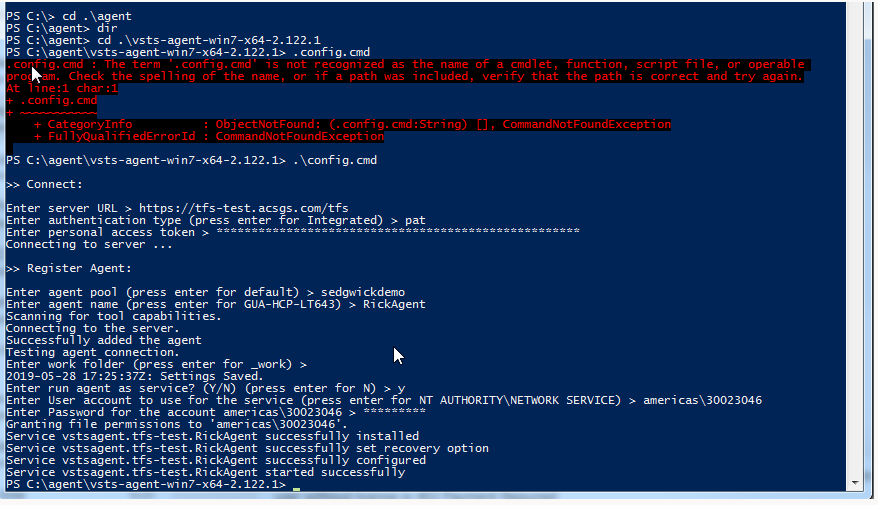
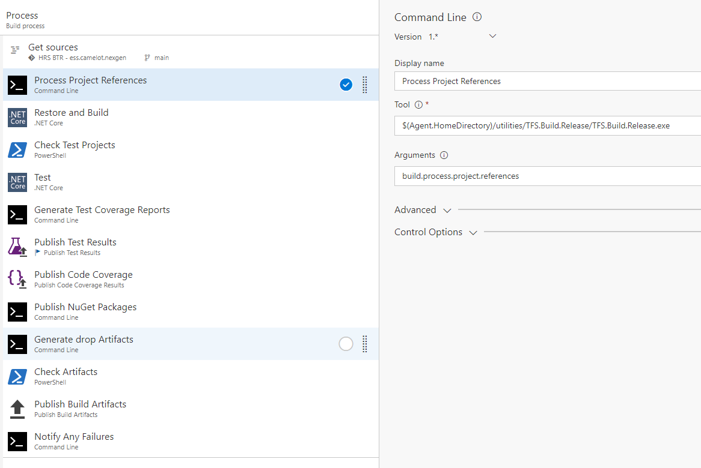
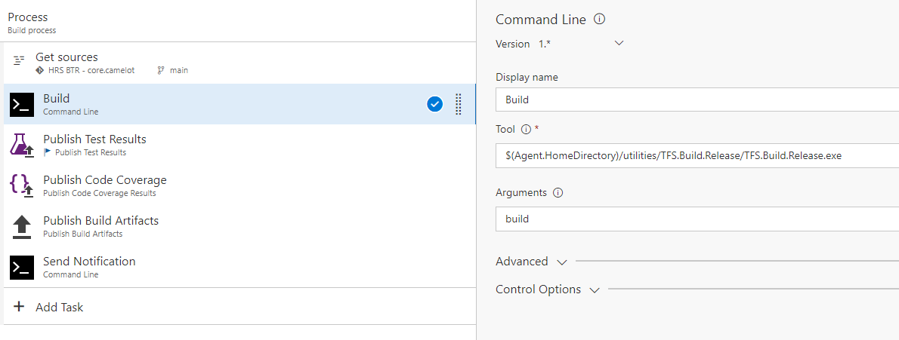
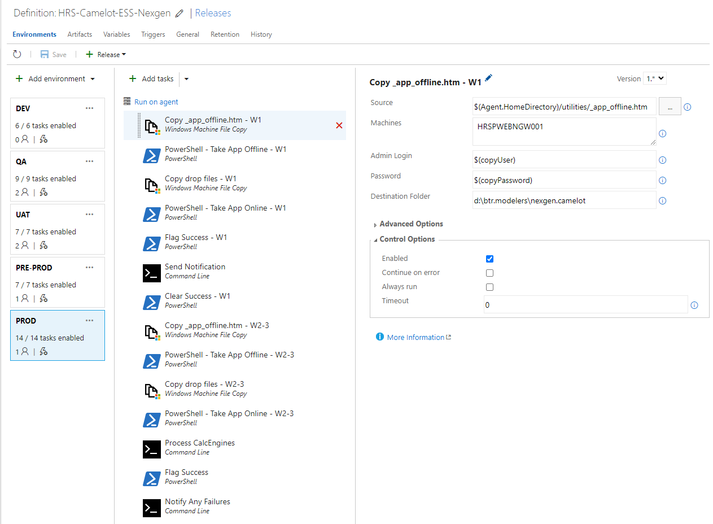
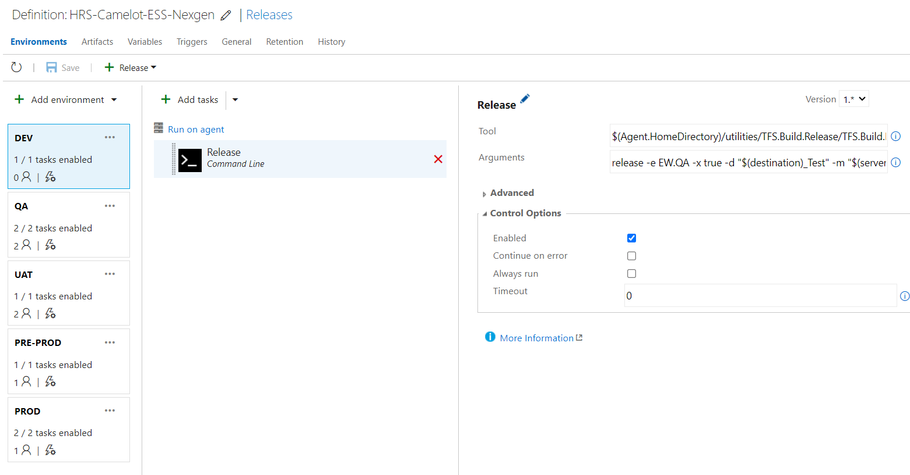
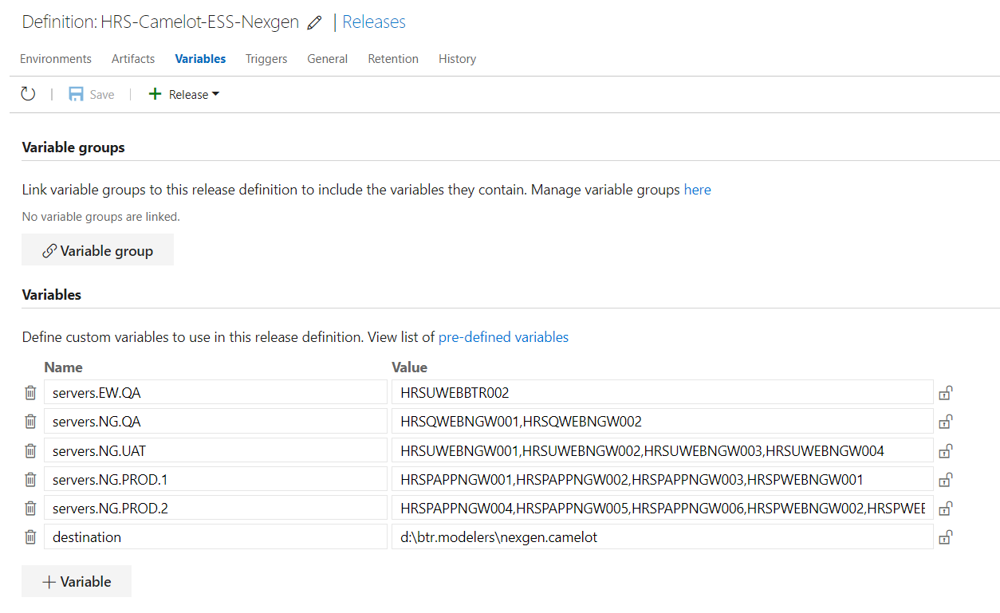

# TFS.Build.Release

A console application that contains utility functions that can be called during the build and release process of TFS CI/CD pipelines.  The biggest motivation of this utility was due to the architecture split of repositories for KAT projects.  The KAT team wanted to continue to leverage 'project references' in project repositories to aid in development and debugging.  However, the TFS build pipeline does not natively support access to other repositories.  The TFS.Build.Release application created commands to accomplish this and many other features not available (i.e. code coverage reports, notifications, etc.).

Please review the following sections for more details.

1. [Installation](#installation)
1. [Supported Commands](#supported-commands)
	1. [build](#build)
	1. [build.notification](#buildnotification)
	1. [release](#release)
	1. [file.copy](#filecopy)
	1. [drop](#drop)
1. [Migrating From KAT to TFS Publishing](#migrating-from-kat-to-tfs-publishing)
	1. [Project File](#project-file)
	1. [Visual Studio](#visual-studio)
	1. [Build / Release Pipeline](#build--release-pipeline)	
1. [Visual Studio Modifications](#visual-studio-modifications)
	1. [Publish External Tool](#publish-external-tool)
	1. [VSColorOutput Extension](#vscoloroutput-extension)
1. [Background](#background)
	1. [Build Pipeline](#build-pipeline)
	1. [Release Pipeline](#release-pipeline)
1. [References](#references)
	1. [Links](#links)
	1. [Nuget Publish Adventure](#nuget-publish-adventure)
		1. [Build Pipeline Structure](#build-pipeline-structure)
		1. [Problems with NuGet](#problems-with-nuget)
			1. [nuget.org Unreachable During Restore](#nugetorg-unreachable-during-restore)
			1. [Unable to Find Private Packages](#unable-to-find-private-packages)
			1. [NuGet Publisher Failing Before Using `build.process.nuget.references` Command](#nuget-publisher-failing-before-using-buildprocessnugetreferences-command)			
	1. [New Pipeline Documentation](#new-pipeline-documentation)
		1. [New Build Pipeline](#new-build-pipeline)
		1. [New Release Pipeline Settings](#new-release-pipeline-settings)
	1. [Original Pipeline Documentation](#original-pipeline-documentation)
		1. [Original Camelot Build Pipeline](#original-camelot-build-pipeline)
		1. [Original Camelot Release Pipeline](#original-camelot-release-pipeline)
		1. [Additional Camelot Build Pipeline Notes](#additional-camelot-build-pipeline-notes)
		1. [Additional Camelot Release Pipeline Notes](#additional-camelot-release-pipeline-notes)
		1. [Original Evolution Build Pipeline](#original-evolution-build-pipeline)

## Installation

1. Deploy the `TFS.Build.Release` application to the TFS build agent under the `$(Agent.HomeDirectory)/Utilities/TFS.Build.Release` folder.
1. Install `reportgenerator` by running the `dotnet tool install dotnet-reportgenerator-globaltool --tool-path D:\tfs.agent\utilities\ReportGenerator` command in a terminal.
1. Add proxy information to `NuGet.config` file so that `dotnet restore` can access [www.nuget.org](https://www.nuget.org/).  See [nuget.org Unreachable During Restore](#nugetorg-unreachable-during-restore) for details.
	1. NG QA Web 1 - HRSQWEBNGW001 server file location: `C:\Windows\System32\config\systemprofile\AppData\Roaming\NuGet\NuGet.Config`
	1. EW QA Web 1 - HRSUWEBBTR002 server file location: `C:\Windows\ServiceProfiles\NetworkService\AppData\Roaming\NuGet\NuGet.Config`
1. Ensure that the Camelot secrets folder has required secret files/settings.
	1. `Camelot.Secrets.json` (and optional environment settings files) that have JWT info needed to communicate with Camelot Apis.
	1. `Camelot.Secrets.Integration.json` file that has secret information needed for Integration testing.
	1. `Tfs.Secrets.json` (and optional environment settings files) that have secrets required to communicate with TFS and/or network computers being published to.
1. Extract [Install.Assets.zip](Assets/Install.Assets.zip) into the `$(Agent.HomeDirectory)/Utilities/` folder.  This contains assets necessary for the tool to function properly.
1. Install [Build Tools for Visual Studio 2022](https://visualstudio.microsoft.com/downloads/?q=build+tools+for+visual+studio) to support .NET Framework (Evolution framework) builds.  This should be installed to `C:\Program Files (x86)\Microsoft Visual Studio\2022\BuildTools\`.

## Installing Agents

The [KAT Agent Queue](https://tfs.acsgs.com/tfs/PDSI/HRS2/My%20Boards/_admin/_AgentQueue?queueId=1546&_a=roles) has all servers/agents listed and their capabilities.

To install a new agent, follow the steps in the screenshot below, but to summarize, run the `.config.cmd` file with the prompt values below:

1. Server Url: `https://tfs.acsgs.com/tfs`
2. Authentication Type: `pat`
3. Personal Access Token: Create a pat from `https://tfs.acsgs.com/tfs/PDSI/_details/security/tokens/Edit` with the `Agent Pool (read, manage)` scope.
4. Agent Pool: `KAT`
5. Agent Name: `environment.machine` (where `environment` is the `ASPNETCORE_ENVIRONMENT` value, and machine is `Web1`, `Data1`, `App1`, `Agent1`, etc.).
6. Work Folder: Simply hit `Enter` to use the default value.
7. Run Agent as Service: `Y`
8. User Account To Use As Service: `americas\winid` (where `winid` is the Windows ID of the user account to run the agent as a service).
9. Password: Enter the password for the user account.



## Supported Commands

1. [build](#build) - Execute all the build, test, and publish commands required for the given repository.
1. [build.notification](#buildnotification) - Sends Telegram notifications to the 'KAT Site Publish' notification account at the end of a TFS build pipeline.
1. [release](#release) - Execute all steps necessary to deploy a release of a KAT site or api.
1. [file.copy](#filecopy) - Copies deployment files from the `drop` artifacts folder to the specified destination/machines.

### build

The `build` command is used to execute all the build, test, and publish commands required for the given repository.  The command will execute the following actions in order:

1. Process References
	1. Inspect `*.csproj` files and pull appropriate repositories and update project references for all 'project references', repeating for each project referenced recursively.  Repositories are pulled into sub folders of the repository being built.
	1. For Evolution framework projects, perform various clean up actions to projects and referenced projects such as restore `packages.config`, fix reference paths, etc. to ensure build success on TFS agent server, repeating for each project referenced recursively.
	1. Create a `Directory.Build.props` file containing version information for the current build, repeating for each project referenced recursively (for Evolution framework projects create an `AssemblyInfo.generated.cs` file).
	1. For each project being built, update project reference relative paths to proper paths on TFS build agent.
1. Build Projects
	1. Build project with `dotnet build` or `MSBuild` CLI (when using `MSBuild` for .NET Framework projects, the project is automatically generates publish artifacts via `-p:DeployOnBuild=true`).
	1. For Evolution framework projects, clean up unwanted artifacts.
	1. For .Net Framework projects, perform `web.config` transforms.
1. Test Projects
	1. For any test projects in the repository, run tests with `dotnet test` CLI using options to generate code coverage files.
	1. Generate code coverage reports with `reportgenerator` tool.  See [installation notes](#installation) for details on how to install `reportgenerator`.
	1. Set the `TestsExists` environment variable to `true` if any tests were ran for use in TFS pipeline conditions.
1. NuGet Packaging
	1. If NuGet configuration provided via `tfs.settings.json` file, create `.nuspec` file and package via `NuGet.exe` CLI.
	1. Publish all NuGet packages to the Conduent `KAT.Nuget.Feed`.  See [Nuget Publish Adventure](#nuget-publish-adventure) for details on how and why this command was implemented.
1. Publish Artifacts
	1. For all projects that are not NuGet packages, publish the results (accomplished via `dotnet publish` CLI for .NET Core projects).
	1. Copy publish artifacts to the `drop` folder.
	1. Set the `ArtifactsExists` environment variable to `true` if any artifacts were published for use in TFS pipeline conditions.

After all these steps are complete, flow returns to TFS build pipeline to continue with native TFS 'publish' tasks.

#### Command Line Arguments

None - All the `*.csproj` files are automatically detected by searching the `BUILD_SOURCESDIRECTORY` environment variable path and processed appropriately (as a build or test).

### build.notification

Send success or failure notifications to the 'KAT Site Publish' notification account at the end of a TFS build pipeline.

#### Command Line Arguments

None - The build status is determined by reading the `AGENT_JOBSTATUS` environment variable.

1. For projects being built that are published to NuGet packages, this task must be run with the `Even if a previous task has failed, even if the build was canceled` condition.
1. For tasks that publish site/api artifacts, this task must be run with the custom condition of `not(succeeded())` to ensure that the notification is only sent when the build fails since successful notifications are sent by the [release](#release) command.

### release

The `release` command is used to execute all steps necessary to deploy a release of a KAT site or api.  The command will execute the following actions in order:

**NOTE**: The `Process CalcEngine Action` and `Process Release Notes` below are skipped if a `release.skip.calcEngines` variable is added to the release with a value of `1`.  This is helpful if a code fix needs to be deployed, but CalcEngines shouldn't be approved or promoted.  After `DEV` environment is published, edit the release and add the variable inside the Variables tab.

1. Wait specified number of seconds if provided in command line arguments.
1. Take application offline (by copying `app_offline.htm` file to the root of the site) and deploying all `drop` files to the destination/machines specified.
1. Swap Settings using the source and destination environments provided (happens automatically for .NET Framework, the `environment` argument is used).
	1. In .NET Core, the `appsettings.{source}.json` file is copied over the `appsettings.{destination}.json` file.  Useful for 'pre-prod' sites that are running in the 'prod' .NET Core environment so need to get 'pre-prod' settings into the 'prod' settings file and used by the site.
	1. In .NET Framework, if a `web.release.{source}.config` file exists from the [build](#build) web.config transforms step, it is copied over the `web.config` file.
1. Process Release Notes
	1. Clone the `{prefix}.releases` repository.  Where `{prefix}` is the current repository name.
	1. Update appropriate environment's 'release notes' readme file by querying CalcEngine history information including date, author, and comments are queried from the `Camelot.Api.DataLocker` api.
	1. Failures will trigger notifications but will not fail the job.  Details to finish the release manually will be logged in the job log.
1. Process CalcEngine Action
	1. CalcEngines are detected via `appsettings.json` file from the site source.
	1. QA normally approves LOWER `Test` CalcEngines to `Live`.
	1. UAT normally promotes LOWER `Live` CalcEngines to UPPER `Test`.
	1. PROD normally approves UPPER `Test` CalcEngines to `Live`.
	1. Failures will trigger notifications but will not fail the job.  Details to finish the release manually will be logged in the job log.
1. Take application online (by removing the `app_offline.htm` file from the root of the site).
1. Send success or failure notifications to the 'KAT Site Publish' notification account.

#### Command Line Arguments

| Argument | Description | Required |
| --- | --- | --- |
| Environment | The `ASPNETCORE_ENVIRONMENT` being deployed to during the `release` command. Use `-e` or `--environment` to specify. | Yes |
| Destination | The destination folder being deployed to (i.e. d:\btr.modelers\nexgen_test).  Use `-d` or `--destination` to specify. | Yes |
| Machines | Comma delimitted list of machines to deploy to.  Use `-m` or `--machines` to specify. | Yes |
| CalcEngineAction | CalcEngine action to perform after files have been deployed.  Options are `Approve` or `Promote`.  Use `-a` or `--calc-engine-action` to specify. | No |
| ClientCalcEnginesToSkip | Comma delimitted list of client keys to skip during CalcEngineAction (only client-skip or client-process can be provided, not both).  Use `--clients-skip` to specify. | No |
| ClientCalcEnginesToProcess | Comma delimitted list of client keys to process during CalcEngineAction (only client-skip or client-process can be provided, not both).  Use `--clients-process` to specify. | No |
| ProcessReleaseNotesRepository | Whether or not to process release notes repository.  Repository name must be the name of the current repository plus the '.release' suffix.  Options are `true` or `false` with the default being `false`.  Use `-r` or `--release-notes` to specify. | No |
| SwapSettings | If `appsettings.{Environment}.config` files need to have settings swapped after file deployment, specify the environments via `source,destination` pair value (i.e. `NG.PRE.PROD,NG.PROD`).  Use `-s` or `--swap-settings` to specify. | No |
| Wait | The number of seconds to wait before starting the deployment.  Useful to allow load balancer management between deployment groups.  Use `-w` or `--wait` to specify. | No |
| RunInParallel | Whether or not to perform actions in parallel when multiple machines are specified.  Options are `true` or `false` with the default being `true`.  Use `-p` or `--parallel` to specify. | No |
| CleanTarget | Whether or not to clean the target folder before copying files.  Options are `true` or `false` with the default being `false`.  Use `-c` or `--clean` to specify. | No |
| RemoveExtra | Whether or not to remove extra files that are not in artifacts but already present in the destination folder.  Options are `true` or `false` with the default being `true`.  Use `-x` or `--remove-extra` to specify. | No |

### file.copy

Copies deployment files from the `drop` artifacts folder to the specified destination/machines.  As of this writing, this command is used to deploy Evolution Admin assemblies to the Hangfire servers.

#### Command Line Arguments

| Argument | Description | Required |
| --- | --- | --- |
| Source | A | delimitted list of regular expressions to match the relative path under the 'drop' folder. Use `-s` or `--source` to specify. | Yes |
| Destination | The destination folder being deployed to.  Use `-d` or `--destination` to specify. | Yes |
| Machines | Comma delimitted list of machines to deploy to.  Use `-m` or `--machines` to specify. | Yes |
| RunInParallel | Whether or not to perform actions in parallel when multiple machines are specified.  Options are `true` or `false` with the default being `true`.  Use `-p` or `--parallel` to specify. | No |

### drop

Simply copies the entire (static) repository to the `/drop` folder (i.e. for KAT Microsite support).

### build.set.nuget.references

During the build process of a repository, all 'project references' must be updated to Nuget package references from the Conduent `KAT.Nuget.Feed`.  Note, NuGet Package dependency resolution is [explained here](https://learn.microsoft.com/en-us/nuget/concepts/dependency-resolution#lowest-applicable-version).  By default, all `*.csproj` file(s) will be automatically detected by searching the `BUILD_SOURCESDIRECTORY` environment variable path.

Note: This command is currently not used in TFS CI/CD, but command is left there as a utility.  Its functionality was replaced by the [build.process.project.references](#buildprocessprojectreferences) command.

#### Command Line Arguments

| Argument | Description | Required |
| --- | --- | --- |
| Include | A comma delimitted list of project names (without the path) to include.  If provided, only these project will be processed. Use `--include` to specify. | No |
| Exclude | A comma delimitted list of project names (without path) to exclude from processing.  Use `--exclude` to specify. | No |


## Migrating From KAT to TFS Publishing

To migrate from KAT to TFS publishing, you need to make each of the following changes.

### Project File

Open the `*.csproj` file in VS Code or text editor and make the following changes:

1\. Add the following properties to the end of the main `PropertyGroup` section of the *.csproj file.  This will be used to generate the `AssemblyInfo.generated.cs` file.  Replace the `000` with appropriate build definition id.

```xml
<KATVersionPrefix>5.2.*</KATVersionPrefix>
<KATBuildDefinition>000</KATBuildDefinition>
```

2\. Set the `PreBuildEvent` and `PostBuildEvent` as follows (**make sure to place this `PropertyGroup` at end of file after all imports**):

```xml
<PropertyGroup>
	<PreBuildEvent>lprun9.exe "C:\BTR\Extensibility\Build.Scripts\Build.Events.linq" Command:ensure.assemblyinfo "ProjectFile:$(ProjectDir)$(ProjectName).csproj"</PreBuildEvent>
	<PostBuildEvent/>
</PropertyGroup>
```

For Admin sites, they need to additionally have the following `PostBuildEvent`:

```xml
<PropertyGroup>
	<PreBuildEvent>lprun9.exe "C:\BTR\Extensibility\Build.Scripts\Build.Events.linq" Command:ensure.assemblyinfo "ProjectFile:$(ProjectDir)$(ProjectName).csproj"</PreBuildEvent>
	<PostBuildEvent>lprun9.exe "C:\BTR\Extensibility\Build.Scripts\Build.Events.linq" Command:post.build ConfigurationName:$(ConfigurationName) "ProjectFile:$(ProjectDir)$(ProjectName).csproj" "BuildFolder:$(TargetDir)\"</PostBuildEvent>
</PropertyGroup>
```

For Windows Services or other Evolution projects where you want to stamp the git hash, instead of the `ensure.assemblyinfo` pre-build event, you should simply use this target:

```xml
<Target Name="StampCommitHash" BeforeTargets="CoreCompile">
  <Exec Command="git rev-parse --short HEAD" ConsoleToMSBuild="true"
        StandardOutputImportance="low" ContinueOnError="true">
    <Output TaskParameter="ConsoleOutput" PropertyName="CommitHash" />
  </Exec>
  <WriteLinesToFile File="Properties\AssemblyInfo.generated.cs" Overwrite="true"
                    Lines="using System.Reflection%3B;[assembly: AssemblyInformationalVersion( &quot;$(CommitHash)&quot; )]" />
</Target>
```

3\. Remove the items:

```xml
<Target Name="BTRWebConfigTransforms" AfterTargets="CopyAllFilesToSingleFolderForPackage">
	<Exec Command="lprun.exe &quot;C:\BTR\Evolution\BTR.Build.Events.linq&quot; WebConfigTransform:1 BuildConfig:$(Configuration) ProjectPath:$(ProjectDir) ProjectName:$(ProjectName) TargetDir:$(WebProjectOutputDir)\$(WPPAllFilesInSingleFolder)" />
</Target>
```

```xml
<UsingTask TaskName="BTR.Evolution.MSBuild.DependencyCopy" AssemblyFile="C:\BTR\Evolution\Assemblies\BTR.Evolution.MSBuild.dll" />
<Target Name="AfterBuild">
	<DependencyCopy StartFolder="$(MSBuildProjectDirectory)" ProjectName="$(ProjectName)" Configuration="$(Configuration)" OutputFolder="$(OutputPath)" />
</Target>
```

Remove all/any `<Analyzer />` items if present.
```xml
<ItemGroup>
	<Analyzer Include="..\..\..\Assemblies\BTR.Evolution.MadHatter.Administration.dll" />
</ItemGroup>
```

4\. Add the following to the `ItemGroup` section of the *.csproj file (next to `AssemblyInfo.cs`):

```xml
<Compile Include="AssemblyInfo.generated.cs">
	<DependentUpon>AssemblyInfo.cs</DependentUpon>
</Compile>
```

### Visual Studio

Open the solution file in Visual Studio and make the following changes:

1. Delete `Properties\PublishSettings` folder.
1. Change anything under `_Developer` folder (if exists) to `BuildAction=None` (usually only Admin sites).
1. Change all `BTR.*` references to project references instead of binary references.

Test building the project to ensure everything works as expected.  **Note:** Do **not** use the `Rebuild` option as it will rebuild your project and all dependent projects.  Instead, use the `Build` option and let Visual Studio determine if a build is necessary for any projects (if code has been changed since last build).

**Save and commit all changes and the project is now ready for TFS publishing.**


### Build / Release Pipeline

Clone existing Evolution Admin and/or ESS build/release pipelines and update the `Variables` tab appropriately.

1. Some Admin release pipelines will need to deal with Hangfire deployments.  See [Michelin Admin Release](https://tfs.acsgs.com/tfs/PDSI/HRS2/My%20Boards/_release?definitionId=120&_a=environments-editor) for an example.
1. Some sites have one off 'freeze' or 'qa' environments to deploy.  See [RTX ESS Release](https://tfs.acsgs.com/tfs/PDSI/HRS2/My%20Boards/_release?definitionId=116&_a=environments-editor) for an example (QA environment).

## Visual Studio Modifications

### Publish External Tool

Create the following external tool to enable triggering a site/api publish:

1. Title: `&KAT Publish`
1. Command: `lprun9.exe`
1. Arguments: `"C:\BTR\Extensibility\Build.Scripts\Build.Events.linq" "ProjectFile:$(ProjectDir)$(ProjectFileName)" "GitType:synced" "Command:queue.cicd" "Tool:Visual Studio"`
1. Initial Directory: `$(ProjectDir)`
1. Use Output Window: `Checked`

### VSColorOutput Extension

To aid in reading all the build and publish output, install the [VSColorOutput](https://marketplace.visualstudio.com/items?itemName=MikeWard-AnnArbor.VSColorOutput) extension.

After installing, modify the settings and add the following patterns to the `RegEx Patterns` settings and move both to the top of the list to ensure they are processed first.

1. Add new pattern:
	1. ClassificationType: `LogError`
	2. IgnoreCase: `false`
	3. Pattern: `.* failed .*`
1. Add new pattern:
	1. ClassificationType: `BuildText`
	2. IgnoreCase: `false`
	3. Pattern: `.*noEmitOnError.*`

## Background

Due to the nature of the KAT project architecture, there are several libraries that are shared across all KAT sites, apis, and/or applications.  This required a repository split minimally between the 'site' and 'libraries'.  Originally, each library was its own repository which aided to the complexity, but ultimately, many projects were grouped into logical library 'buckets'.  Additionally, there were several actions that needed to occur during the build and/or release pipline that was not supported by TFS.

### Build Pipeline

At a high level, the build pipline had to accomplish the following:

1. Project Project References
1. Restore all Nuget Packages and Build the project.
1. Run any existing test projects.
1. Generate code coverage reports.
1. Publish Test Results if there were test projects ran.
1. Publish Code Coverage Reports if there were test projects ran.
1. Create and publish NuGet packages if building library assemblies.
1. Generate 'drop' artifacts if building a site or api project.
1. Publish artifacts to the TFS drop location if present.
1. Send a notification to the 'KAT Site Publish' Telegram account.

Originally, there was a pipeline structure that looked like the following:



As you can see, the steps were even more complex than the pipeline described above.  This is due to the fact that some of the TFS tasks would fail when really they should simply be skipped.  For example, the 'Check Test Projects' is just a PowerShell script that looked for projects with `\tests\` in the path, and if any were found, set an environment variable.  Then all the 'test tasks' (i.e. Publish Test Results) had a custom condition to run only when that variable was present.  Without this conditional logic, the build would fail if there were no test results to publish and the task attempted to run.

More details will be provided about the features displayed in the pipeline structure above, but the constant context switching of native TFS tasks versus tasks provided by this utility was a constant struggle and made communication between steps/tasks more difficult.  This lead to the final version of the [build](#build) command that would execute all the necessary steps in the correct order to build, test, and 'publish' the project.  The pipeline was reduced to the following:



I did not investigate how to perform the native 'publish' commands, so there is still one context switch from this utility back to native TFS to accomplish that.

### Release Pipeline

Similar to the build pipeline, the release pipeline had to accomplish the following:

1. Take .NET Core applications offline.
1. Publish drop artifacts to desired locations/machines.
1. Take .NET Core appilcations online.
1. Send a notification to the 'KAT Site Publish' Telegram account.

There were some other custom features specific to KAT frameworks/technogies that needed to be accomplished during the release pipeline (i.e. CalcEngine processing, Swap Settings, etc) that will be discussed in more details below.  

The pipeline was doubly complicated when server groups (i.e. during a PROD publish) were introduced, requiring two cycles of tasks.  A sample of this complexity can be seen below:



And just like the [build pipeline](#build-pipeline), the release pipeline was reduced to the final version of the [release](#release) command to avoid the context switching between native TFS tasks and tasks provided by this utility:



## References

### Links

1. [TFS Pipeline Variables](https://learn.microsoft.com/en-us/azure/devops/pipelines/build/variables?view=azure-devops&tabs=yaml)
1. NuGet Packages
	1. [How NuGet resolves package dependencies](https://learn.microsoft.com/en-us/nuget/concepts/dependency-resolution)
	1. [Dotnet pack - include referenced projects](https://josef.codes/dotnet-pack-include-referenced-projects/)
	1. [Stackoverflow - Include all dependencies using dotnet pack](https://stackoverflow.com/questions/40396161/include-all-dependencies-using-dotnet-pack)
1. [ReportGenerator](https://github.com/danielpalme/ReportGenerator)
1. Code Coverage Reports
	1. [Publish code coverage results to Azure pipeline with Cobertura and Coverlet for C# .Net 6 project](https://medium.com/@hashanpallewatte/publish-code-coverage-results-to-azure-pipeline-with-cobertura-and-coverlet-for-c-net-6-project-8c911d63f3df)
	1. [The Easiest Way to Generate and Publish .NET Code Coverage in Azure DevOps](https://josh-ops.com/posts/azure-devops-code-coverage/)
		1. Comment about [test threshold](https://github.com/joshjohanning/joshjohanning.github.io/issues/10#issuecomment-1950962191) haulting a build if too many tests fail.

### Nuget Publish Adventure

The original migration to TFS CI/CD did **not** leverage a 'real' build.  A site/api project dependency graph was deemed too complex; with several project references, each of which had their set of project references, etc.  The solution to this was to have local VS Code Tasks that built the projects (and all dependent project references), then published the output to a `\.deploy` folder.  The `\.deploy` folder was then committed to the repository and used as the Build pipeline 'source' instead of leveraging a TFS build agent/task.  This may have additionally required the `build.copy.csproj.assets` command or a native TFS `Copy Files` command with asset patterns (i.e. `xml\*.xml; wwwroot\**; appsettings*.json) as needed.

As the needs of CI/CD grew (i.e. Test results and Code coverage reports), leveraging the TFS build agent became necessary along with the `build.process.nuget.references` and `build.publish.nuget.packages` commands.  The KAT team wanted to continue to leverage 'project references' in the repository to aid in development and debugging.  However, the TFS build agent does not have access to other repositories and needed to leverage Nuget packages.  The TFS.Build.Release application created commands to accomplish this.

#### Build Pipeline Structure

The typical Build pipeline for any project is constructed with the following tasks:

1. **Get Sources** - pull source of the appropriate repository.
1. **Process Nuget References** - `Command Line` task that calls the `build.process.nuget.references` command.
1. **Build and Package** - `.NET Core` task that builds the project and creates `*.nupkg` files.
    1. Command: `pack`
	1. Project(s): `**/*.csproj`
	1. Arguments: `--configuration Release --output $(build.artifactstagingdirectory)/packages /p:Version=$(Build.BuildNumber)`
1. **Publish Nuget Packages** - `Command Line` task that calls the `build.publish.nuget.packages` command.

To Summary What Happens in Each Task above:

1. **Get Sources** - pull latest code into the `$(Build.SourcesDirectory)` folder.
1. **Process Nuget References** 
    1. Scans all `*.csproj` files in the `$(Build.SourcesDirectory)` folder and updates all 'project references' to Nuget package references from the Conduent `KAT.Nuget.Feed`.
	1. Creates a `NuGet.config` file in the `$(Build.SourcesDirectory)` folder that provides required information for the Conduent `KAT.Nuget.Feed`.
1. **Build and Package**
	1. Restores all packages for all projects.
	1. Builds all projects.
	1. Creates `*.nupkg` files for all projects into the `$(build.artifactstagingdirectory)/packages` folder.
1. **Publish Nuget Packages** - Publishes all `$(build.artifactstagingdirectory)/packages/*.nupkg` files to the Conduent `KAT.Nuget.Feed`.

#### Problems with NuGet

Various problems arose during the different iterations of the Build pipeline.  The following are all of the problems encountered at various iterations and their solutions.

##### nuget.org Unreachable During Restore

**Problem:** The `dotnet restore` command was failing because it could not reach the `https://api.nuget.org/v3/index.json` NuGet feed.  The response was similar to:

> error NU1301: Unable to load the service index for source https://api.nuget.org/v3/index.json.

**Solution:** I was able to add proxy settings to the `%AppData%/Roaming/NuGet/NuGet.config` file and then the `dotnet restore` command worked.  I followed the advice from this [Stackoverflow answer](https://stackoverflow.com/a/53987500/166231) and added the following to the `NuGet.config` file:

```xml
  <config>
    <add key="http_proxy" value="http://10.138.171.254:9191" />
    <add key="https_proxy" value="http://10.138.171.254:9191" />
  </config>
```


##### Unable to Find Private Packages

**Problem:** Originally, the `dotnet pack` command was failing stating that it couldn't find 'KAT.Camelot.Domain' package (really any privately hosted NuGet package).  The response was similar to:

> error NU1101: Unable to find package KAT.Camelot.Domain. No packages exist with this id in source(s): nuget.org

**Solution:** The `NuGet.config` had to be updated to contain the source for the Conduent `KAT.Nuget.Feed`. The file was created in the `$(Build.SourcesDirectory)` folder so that it would be used by the `dotnet pack` command (since it was in a parent folder to the `*.csproj` file) to restore the required packages.

First configuration attempt was:

```xml
<?xml version="1.0" encoding="utf-8"?>
<configuration>
  <packageSources>
    <add key="KAT.Nuget.Feed" value="https://tfs.acsgs.com/tfs/PDSI/_packaging/KAT.Nuget.Feed/nuget/v3/index.json" protocolVersion="3" />
  </packageSources>
</configuration>
```

However, this failed with the following response:

> error NU1301: Unable to load the service index for source https://tfs.acsgs.com/tfs/PDSI/_packaging/KAT.Nuget.Feed/nuget/v3/index.json.

Although the message doesn't state it, even with `-v normal` flag, the problem was authorization.  After some trial and error, I followed the advice from [this blog post](https://duanenewman.net/blog/post/2019-07-29-basic-auth-with-tfs-package-server/) and ended up with the following `NuGet.config` file where {AccessToken} was obtained via `Environment.GetEnvironmentVariable( "SYSTEM_ACCESSTOKEN" )` after enabling the `Allow scripts to access OAuth token` option on the Build pipeline:

```xml
<?xml version="1.0" encoding="utf-8"?>
<configuration>
  <packageSources>
    <add key="KAT.Nuget.Feed" value="https://tfs.acsgs.com/tfs/PDSI/_packaging/KAT.Nuget.Feed/nuget/v3/index.json" protocolVersion="3" />
  </packageSources>
  <packageSourceCredentials>
    <KAT.Nuget.Feed>
      <add key="Username" value="TFS.Build.Release" />
      <add key="ClearTextPassword" value="{AccessToken}" />
      <add key="ValidAuthenticationTypes" value="basic" />
    </KAT.Nuget.Feed>
  </packageSourceCredentials>
</configuration>
```

**NOTE:** I wanted to inject the NuGet proxy information here, but even though NuGet log stated that it used this file, the requests to nuget.org would fail.

##### NuGet Publisher Failing Before Using `build.process.nuget.references` Command

**Problem:** Before the `build.process.nuget.references` command was even created the 'NuGet Publisher' was failing with a response similar to:

> error NU1301: Unable to load the service index for source https://tfs.acsgs.com/tfs/PDSI/_packaging/KAT.Nuget.Feed/nuget/v3/index.json.

**Solution:** I was able to find [NuGetCommand](https://learn.microsoft.com/en-us/azure/devops/pipelines/tasks/reference/nuget-command-v2?view=azure-pipelines#inputs) documentation explaining the `arguments` parameter stating:

> If NuGet 3.5 or later is used, authenticated commands like list, restore, and publish against any feed in this organization or collection that the Project Collection Build Service has access to will be automatically authenticated.

I discovered that the `NuGet Version` setting (found under the Advanced section) for 'NuGet Publisher' was set to `3.3.0`.  I changed it to `3.5.0` and the 'NuGet Publisher' was able to successfully publish the `*.nupkg` files to the Conduent `KAT.Nuget.Feed`.

##### NuGet Publisher Failing When Using `build.process.nuget.references` Command

**Problem:** All tasks where working except for the `Publish Nuget Packages` task.  It was failing with a response similar to:

> (401) Unauthorized.  No credentials are available in the security package

**Solution:** I posted a [Stackoverflow question](https://stackoverflow.com/questions/77978221/tfs-nuget-publisher-task-fails-with-401-no-credentials-are-available-in-the-secu) that is verbose in nature since source code and context aren't implied.  To summarize, the `NuGet.config` file was being created in the `$(Build.SourcesDirectory)` was somehow affecting 'NuGet Publisher'.  A Microsoft employee responded to the question with:

> By default, the "NuGet Publisher" task use the Project Collection Build Service account to publish the packages to the feed. It seems that the process is destroyed by the Command Line task. It tries to use NuGet.config to do the authorization.

Following their suggestion, I attempted to simply use a Command Line task that wrapped a call to `nuget push` via the following:

```csharp
var nugetExe = variables.NugetPath;

var publishCommand = Cli.Wrap( nugetExe )
	.WithWorkingDirectory( packageDirectory )
	.WithArguments( new string[] { "push", Path.GetFileName( packageFile ), "-src", "KAT.Nuget.Feed", "-Verbosity", "normal", "-ConfigFile", nugetConfig, "-NonInteractive", "-ApiKey", "VSTS" } )!;

await publishCommand.ExecuteBufferedAsync();
```

Note that I copied a `3.5.0` version of `nuget.exe` into the utilities folder of the TFS build agent.  However, executing this, still failed with the following:

```
Executing: `D:\tfs.agent\utilities\nuget.3.5.0\nuget.exe push KAT.Camelot.Domain.1.0.40.nupkg -src KAT.Nuget.Feed -Verbosity detailed -ConfigFile D:\tfs.agent\_work\25\s\NuGet.config -NonInteractive -ApiKey VSTS`
Unable to process TFS CI/CD command(s).
NuGet.Protocol.Core.Types.FatalProtocolException: Unable to load the service index for source https://tfs.acsgs.com/tfs/PDSI/_packaging/KAT.Nuget.Feed/nuget/v3/index.json.
System.Net.Http.HttpRequestException: An error occurred while sending the request.
System.Net.WebException: The remote server returned an error: (401) Unauthorized.
System.ComponentModel.Win32Exception: No credentials are available in the security package
```

I am fairly certain it was correctly using the `D:\tfs.agent\_work\25\s\NuGet.config` configuration file because it could resolve `-src KAT.Nuget.Feed` to the correct url of `https://tfs.acsgs.com/tfs/PDSI/_packaging/KAT.Nuget.Feed/nuget/v3/index.json` but it did not use the correct credentials.  The Microsoft employee suggested:

```
nuget sources Add -Name "KAT.Nuget.Feed" -Source https://tfs.acsgs.com/tfs/XXXX/_packaging/KAT.Nuget.Feed/nuget/v3/index.json -UserName MyUserName -Password value -config ./nuget.config
nuget push nupkgs/mypackage.1.1.8.nupkg -src MySource -ApiKey AZ
```

When I ran this command, two points occurred.

1. In the `NuGet.config` file, the `packageSourceCredentials` section was updated with the `UserName` and `Password` (instead of `ClearTextPassword` which I had been using) and was going to have to figure out how to create the proper format for that because just using {AccessToken} was not permitted.
1. If I ran that command on the build server and passed in the property {AccessToken} to the `sources Add` command, then attempted a `push`, I received the exact same error as before.

Finally, I decided to try and use the [NuGet Push Api](https://learn.microsoft.com/en-us/nuget/api/package-publish-resource) since I was already successfully  authenticating and using the [NuGet Search Api](https://learn.microsoft.com/en-us/nuget/api/search-query-service-resource).  The PUT request was implemented as follows:

```csharp
using var request = new HttpRequestMessage( HttpMethod.Put, "https://tfs.acsgs.com/tfs/PDSI/_packaging/5dbfd80f-1bf7-4a6d-b222-6049c75603fe/nuget/v2/" )
{
	Content = new MultipartFormDataContent
	{
		{ new ByteArrayContent( await File.ReadAllBytesAsync( packageFile ) ), "file", Path.GetFileName( packageFile ) }
	}
};

using var response = await httpClient.SendAsync( request );
```

This also threw an exception and returned the following response:

> Bad Request.  Expected a single 'application/octet-stream' part.

**Finally...Success!**

Following this [Stackoverflow comment](https://stackoverflow.com/questions/60176740/uploading-multipart-form-files-with-httpclient#comment106464323_60191497) I added a `ContentType` to the `ByteArrayContent` and the `NuGet Push Api` worked.  The final implementation was:

```csharp
var binaryContent = new ByteArrayContent( await File.ReadAllBytesAsync( packageFile ) );
binaryContent.Headers.ContentType = new MediaTypeHeaderValue( "application/octet-stream" );

using var request = new HttpRequestMessage( HttpMethod.Put, "https://tfs.acsgs.com/tfs/PDSI/_packaging/5dbfd80f-1bf7-4a6d-b222-6049c75603fe/nuget/v2/" )
{
	Content = new MultipartFormDataContent
	{
		{ binaryContent, "file", Path.GetFileName( packageFile ) }
	}
};

using var response = await httpClient.SendConduentAsync( request );
```

### New Pipeline Documentation

Below is image dump of how pipelines were setup as of this writing.

#### New Build Pipeline

**Step 1: Build**


**Step 2: Publish Test Results**


**Step 3: Publish Code Coverage**


**Step 4: Publish Build Artifacts**


**Step 5: Send Notification**

For NuGet projects, this step should be ran in every situation (success, fail, or cancel).  For sites/apis, this step should only be ran when not successful.


#### New Release Pipeline Settings

There is normally only a single [release](#release) command ran for each environment (with the exception of one of locations or Hangfire deployments).

1. Each environment has demand of 'server' environment that it is deploying to (i.e. EW.QA, EW.PROD, etc.).
2. Each release pipeline has the variables displayed in the screen shot (additionally, some pipelines have servers.EW.PROD).
	1. servers
3. The most common pattern for commands in each environment are:
	1. DEV: `release -e EW.QA -x true -d "$(destination)_Test" -m "$(servers.EW.QA)"`
	2. QA: `release -e NG.QA -x true -d "$(destination)_Test" -m "$(servers.NG.QA)"`
	3. UAT: `release -e NG.UAT -x true -d "$(destination)_Pending" -m "$(servers.NG.UAT)"`
	4. PRE PROD: `release -e NG.UAT -x true -d "$(destination)_Pending" -m "$(servers.NG.PROD.1),$(servers.NG.PROD.2)"`
	5. EW PRE PROD: `release -e EW.PRE.PROD -x true -d "$(destination)_Pending" -m "$(servers.EW.PROD)"`
	5. EW PROD: `release -e EW.PROD -x true -d "$(destination)" -m "$(servers.EW.PROD)"`
	6. PROD - has following two tasks, notice 15 second wait on second task.
		1. `release -e NG.PROD -x true -d "$(destination)" -m "$(servers.NG.PROD.1)"`
		1. `release -e NG.PROD -w 15 -x true -d "$(destination)" -m "$(servers.NG.PROD.2)"`
4. Nexgen has following differences:
	1. QA additionally has `-a Approve -r true` to approve LOWERs and update release notes.
	3. UAT additionally has `-a Promote` to promote LOWERs to UPPERs.
	4. PROD (second task) additionally has `-a Approve -r true` to approve UPPERs and update release notes.

**Variables**


**Environments and Tasks**


**Run on Agent Settings**

Each environment should have a demand of the environment name that files are getting deployed to.


### Original Pipeline Documentation 

Below is just an image dump of how the original pipelines were setup displaying all their options for reference and what they migrated to.

#### Original Camelot Build Pipeline

**Step 1: Process Project References**


**Step 2: Restore and Build**


**Step 3: Check Test Projects**


**Step 4: Test**


**Step 5: Generate Test Coverage Reports**


**Step 6: Publish Test Results**


**Step 7: Publish Code Coverage**


**Step 8: Publish NuGet Packages**


**Step 9: Generate drop Artifacts**


**Step 10: Check Artifacts**


The full script was not visible.  Here is the full script:

```powershell
$dropFiles = @()
$dropPath = "$(build.artifactstagingdirectory)\drop"

if (Test-Path $dropPath) {
    $dropFiles = Get-ChildItem -Path $dropPath -File
}

if ($dropFiles) {
    Write-Output "$($dropFiles.Count) drop files found."
    Write-Output "##vso[task.setvariable variable=ArtifactsExists]True"
}
else {
    Write-Output "No drop files found."
}
```


**Step 11: Publish Build Artifacts**


**Step 12: Notify Any Failures**


#### Original Camelot Release Pipeline

1. Release variables only includes password
1. Each environment has its own copyUser variable
1. Each environments steps are the same as DEV with the following exceptions.
	1. QA
		1. Machine list is different
		1. Copies to NG _Test and and EW.QA _Pending (pending is for a _freeze site, not sure if that site is even needed)
		1. QA has Process CalcEngines to approve LOWERs to Live and also updates .releases markdown files to reflect CalcEngine changes in QA.
	1. UAT
		1. Machine list is different
		1. Copies to NG _Pending
		1. UAT has Process CalcEngines to promotes LOWERs to UPPERs (Test).
	1. PRE-PROD
		1. Machine list is different
		1. Copies to NG _Pending
		1. Has a 'Swap Settings' step that moves appsettings.NG.PRE.PROD -> appsettings.NG.PROD since the environment is NG.PROD for both PRE-PROD and PROD.
	1. PROD
		1. Machine list is different
		1. Copies to NG (Live)
		1. Has 2 groups of servers, so does all steps for one group, then repeats for second group (**with a delay on first powershell task to allow for LB management**)
		1. UAT has Process CalcEngines to approve UPPERs and also updates .releases markdown files to reflect CalcEngine changes in PROD.

Multi-machine Take Offline

```powershell
$machineNames = "HRSQWEBNGW001", "HRSQWEBNGW002"

foreach ($machineName in $machineNames) {
    Rename-Item -Path "\\$machineName\d$\btr.modelers\nexgen.camelot_test\_app_offline.htm" -NewName "app_offline.htm"
}

Rename-Item -Path "\\HRSUWEBBTR002\d$\btr.modelers\nexgen.camelot_pending\_app_offline.htm" -NewName "App_Offline.htm"
```

**Step 1: Copy app_offline**


**Step 2: Take Offline**


**Step 3: Copy drop to Destination**


**Step 4: Take Online**


**Step 5: Flag Success**


**Step 6: Send Notification**


**QA Environment Settings**

Following shows 'Process CalcEngines' action as well as publishing to a secondary (Freeze) location.


**UAT Environment Settings**

Displays 'Process CalcEngines' action.


**PRE-PROD Environment Settings**

Displays 'Swap Settings' action.


**PROD Environment Settings**

Displays 'Process CalcEngines' action and multi-group deployment.


#### Additional Camelot Build Pipeline Notes

**DataLocker Api**

Same as Camelot.Nexgen.Build Except:

1. Test step is disabled because build servers don't support Docker images (for Sql TestContainers)
2. Repository includes `tests/Integration/TestResults` folder with `coverage.cobertura.xml` and `TestResults.trx`.  Both resulting from local 'test' call before committing so build server can run steps to publish test results and code coverage.

**RBLe Api**

Same as Camelot.Nexgen.Build.

**WebService.Proxy Api**

Same as Camelot.Nexgen.Build.

#### Additional Camelot Release Pipeline Notes

**WebService.Proxy Api**

Camelot.Api.WebService.Proxy Release

Same as Camelot.Nexgen.Release with the following exceptions

1. No environments have Process CalcEngines (or .releases markdown update) step.
1. No environments have a 'Swap Settings' step.
1. There is an EW PROD environment that copies to EW (Live) and has a different machine list (mostly only for the Notification feature of Proxy, not necessarily MCP or Nexgen apis).

#### Original Evolution Build Pipeline

Build steps are same for apis and sites (libraries weren't implemented when I converted)

General idea was:

1. Publish site/api to local .deploy folder
2. Post build cleans up as many files from .deploy that it can (files that are accessible in the code base)
3. When TFS Build runs
	1. Copy .deploy to artifacts
	2. Walk *.csproj and copy any files that are needed in the site to artifacts (files removed in step 2 above).
	3. Publish artifacts
	4. Send notifications

**Step 1: Copy .deploy**


**Step 2: Run build.evolution.copy.assets**


**Step 3: Publish Artifacts**


**Step 4: Failure Notifications**

