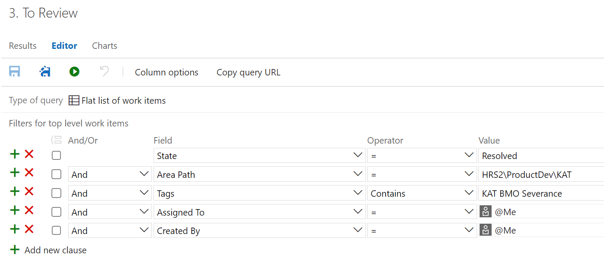

# Migrating from TM to TFS

This document describe how we can set up TFS queries, tags, and task states to mimic the KAT TM workflow when creating and working with tasks for projects built on the Evolution framework.

To enable this, you will create custom queries that filter based on 'KAT tags' describing each client.  Tags are used simply due to the fact that we can't create new clients without the help of an admin.  So using a single project (`HRS2/KAT`) with custom tags was the easiest transition.

After [TFS Queries](#tfs-queries-to-emulate-tm-workflow) are set up, you will use a work flow that is managed based on `Created By`, `Assigned To` and `State` fields.  The [Task Workflow](#task-workflow) section describes the workflow in detail.

In this document, 'Requestors' are the people who create the tasks, and 'Workers' are the people who implement the tasks.

## Task Workflow

This section describes the workflows for creating and working with tasks.

### Requestor Workflows

This section describes the workflows for creating and working with tasks from the perspective of the Requestor.

#### Creating Task

The steps below describe how to create a task.

1. If creating a Spec Sheet request task:
	1. Update the Spec Sheet `Requirement` task by uploading the latest Spec Sheet and updating the title of the task to reflect the version.
	1. Optional; Would be *nice* to copy the ID of the spec task before starting task, then when creating the 'request' task, create a link of type `Parent` and paste the Spec Sheet task ID in.  Makes it easier for Worker to download the file.
1. Add correct `Tag`... `KAT {clientName}`.
1. Set `Title` using a prefix of `{clientName} ` (from tag used in previous step).  This aids in the [All Tasks To Do Query](#all-tasks-to-do-query-worker).
1. Set `Assigned To` to the appropriate person.  This sends a notification and makes their [Tasks to Do Query](#to-do-query-worker) work.
1. Optional; Attach any required files/screenshots in the 'attachments' tab/area.
1. Optional; If the task is related to other task(s), or points to a task (within current KAT Client or across all KAT Clients) that implemented a similar feature, you could add link of type `Related` to task in the 'links' tab/area.

#### To Reopen Task That Is Review

After reviewing an implemented task, if there are existing issues or new issues, simply:

1. Set `Assigned To` to the appropriate person.  This sends a notification and makes their [Tasks to Do Query](#tasks-to-do) work.
1. Set `State` to Active
1. Add a `Discussion` with relevant information describing the problem.
1. Save the task.

#### To Request Production Publish

After reviewing one or more tasks, if you are ready to request a publish to production, you can do one of the following:

1. Create new task as described in the [Creating Task](#creating-task) section with a simple `Title` saying 'Publish to Production'.
1. Save the task.
1. Change all tasks in your [Tasks To Review](#tasks-to-review) query to `Closed`.
1. Watch for publish notification in Telegram.

Or, you can modify one or all of the existing tasks in your 'Tasks to Review' by:

1. Set `Assigned To` to the appropriate person.
1. Add a `Discussion` requesting a publish.
1. If you only modified one task, change all remaining tasks to `Closed`.

### Worker Workflows

This section describes the workflow for creating and working with tasks from the perspective of the Worker.

#### To Start Working on Task

As a Worker, when you start working on a task, simply:

1. Set `State` to Active
1. Save the task and start working.

#### To Request Additional Information

If you the Worker of a task, but need additional information from the Requestor who created the task, simply:

1. Set `Assign To` back to the Requestor (can find this in the 'History' tab/area of the task if you don't know).  This triggers a notification to the Requestor, but we use `Assigned To` instead of `@id` in `Discussions` to make the [Tasks to Do Query](#tasks-to-do) work.
1. Ask your questions to the Requestor via the `Discussion` area.
1. Optional; `@` additional people if you want them to receive notifications and/or they are able to provide information as well.
1. Save the task.

#### To Complete Task And Notify Immediately

As the Worker of a task, when you have completed a task and are ready to publish and notify the Requestor, simply:

1. Publish to QA
1. Set `Assign To` back to the Requestor (can find this in the 'History' tab/area of the task if you don't know).  This triggers a notification to the Requestor, but we use `Assigned To` instead of `@id` in `Discussions` to make their [Tasks to Review Query](#tasks-to-review) work.
1. Set `State` = Resolved.
1. Add a `Discussion` with any relevant information about your implementation (usually 'Done' is suffice).
1. Save the task.

#### Task Batches

As the Worker, you can choose to work on a batch of tasks and postpone notifying the Requestor until all tasks have been published at once.

##### To Complete Task Without Notifying Requestor Immediately

As the Worker of a task, there maybe be several tasks you plan on doing before publishing the site and you don't want the Requestor to be notified on each one until you've finished the batch of tasks.  This is the same as the TM 'Pending Notifications' state.  To accomplish this:

1. Set `Triage` to `Triaged`.  This will move the task out of the [Tasks to Do Query](#to-do-query-worker) and into the [Pending Notifications Query](#pending-notifications-query-worker).
1. Add a `Discussion` with any relevant information about your implementation (usually 'Done' is suffice).
1. Save the task.

##### To Notify Requestor Multiple Tasks Are Ready For Review

As the Worker of a task, when you have completed a batch of tasks and are ready to publish and notify the Requestor (this is the same as clicking 'Send Notification' in TM), simply:

1. Publish site to QA.
1. Go to your [Pending Notifications Query](#pending-notifications-query-worker) and select all tasks you want to notify the Requestor about and:
	1. Set `Assign To` back to the Requestor (can find this in the 'History' tab/area of the task if you don't know).  This triggers a notification to the Requestor, but we use `Assigned To` instead of `@id` in `Discussions` to make their [Tasks to Review Query](#to-review-query-requestor) work.
	1. Set `Triage` = Pending (or anything other than Triaged). This will move it out of the Pending Notifications Query.
	1. Set `State` = Resolved.
	1. Save the tasks.

### After Publishing to Production

As a Worker, when you have tasks in your [To Publish Query](#tasks-to-publish), simply:

1. Publish the site to Production.
1. Set `Assigned To` to Requestor to notify them you have 'sent' the publish.
1. Set `State` to Closed.

## TFS Queries To Emulate TM Workflow

This section describes how TFS is used to create 'states' a task that emulate the KAT TM workflow.  For each client you work on, under the 'My Queries' folder, you will create a folder with the name of the client.  Within that folder, you will create one or more of the queries described below (each being scoped to a `KAT {clientName}` tag).

After all desired queries have been created, if you start to work on a new client, simply create a new client folder under 'My Queries' and for each query in an already existing client, click 'Save As' and save it to the new client folder.  Then the only modification you have to make is to change the `Tags` to be the appropriate `KAT {clientName}` tag.

### To Do Query (Worker)

The fields that enable this state/query to work are:

1. `State`: Active, Proposed
1. `Assigned To`: Me
1. `Triage`: NOT Triaged

In TFS, the following Query should be created.

### Pending Notifications Query (Worker)

The fields that enable this state/query to work are:

1. `State`: Resolved
1. `Assigned To`: Me
1. `Triage`: Triaged

In TFS, the following Query should be created.

### To Review Query (Requestor)

The fields that enable this state/query to work are:

1. `State`: Resolved
1. `Assigned To`: Me
1. `Created By`: Me
1. `Triage`: NOT Triaged

In TFS, the following Query should be created.

### To Publish Query (Worker)

The fields that enable this state/query to work are:

1. `State`: Resolved
1. `Assigned To`: Me
1. `Created By`: NOT Me
1. `Triage`: NOT Triaged

In TFS, the following Query should be created.

### All Tasks Query

In TFS, the following Query should be created to show all tasks for a specific client.

### Client Independent Queries

All the queries described above in this section are scoped to a specific KAT client.  However, it is useful to have a 'To Do' query and 'To Review' query across all your clients so you don't have to drill into each of your client looking for tasks.  The following queries are *not* scoped to clients but have the same basic structure.

#### All Tasks To Do Query (Worker)

In TFS, the following Query should be created *outside of all client folders* to show all tasks that need implementation regardless of client.

#### All Tasks To Review Query (Requestor)

In TFS, the following Query should be created *outside of all client folders* to show all tasks that you've created and need review regardless of client.

#### All Recent Tasks Query

This query doesn't emulate any pattern from KAT TM, but it can be helpful to see all tasks that worked on in the last 7 days regardless of client.  It is helpful because if you've recently changed the 'state/workflow' of a task and it is no longer present in any of your other queries, you can find it here in case you needed to make quick updates.

In TFS, the following Query should be created *outside of all client folders* to show all tasks that you've worked on in the last 7 days regardless of client.

